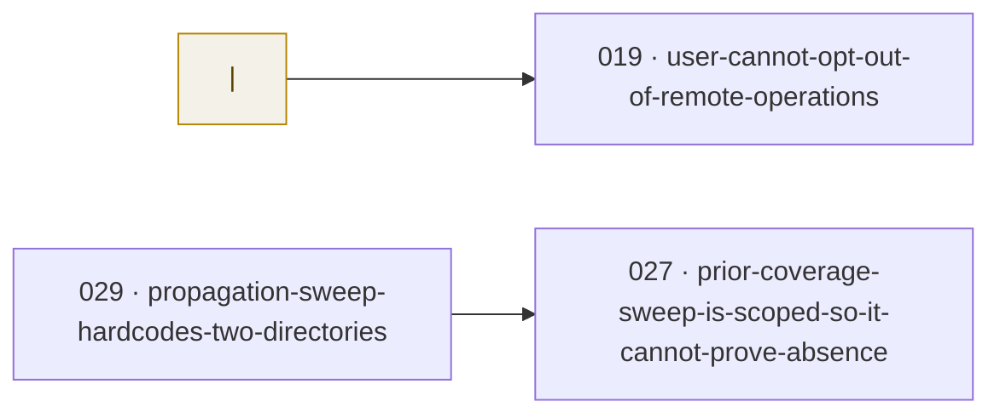

<!--
  GENERATED FILE — do not hand-edit.
  Source: tasks/<status>/NNN-*.md frontmatter + H1 titles.
  Regenerate: scripts/generate-task-board.py  (--check reports staleness)
-->

# Task board

Projection of `tasks/` — the directory is the tracker, this is its view. Columns are the
lanes in flow order; `prioritized/` is in pull order. Regenerated on demand, not on every
move — so this view can lag the tracker, and the tracker wins.
Cards show `owner · last updated`, and `⛔` on a blocked task — a task number when another
task gates it, `condition` when nothing but a judgement call does.

**34 tasks** — 13 new · 0 prioritized · 1 wip · 2 blocked · 18 done.

WIP limit: within 3 per human owner.

| new (13) | prioritized (0) | wip (1) | blocked (2) |
|---|---|---|---|
| **[012](../tasks/new/012-install-is-verified-once-by-hand.md)** Installability is the product, and it is checked once by h… justmaniv · 2026-08-07 | _nothing triaged_ | **[034](../tasks/wip/034-numbering-scan-is-best-effort-and-its-worktree-half-is-corrupted-at-render.md)** The numbering scan is presented as the safeguard, and its… justmaniv · 2026-08-30 | **[019](../tasks/blocked/019-user-cannot-opt-out-of-remote-operations.md)** A user can turn off remote and host operations even when a… justmaniv · 2026-08-11 · ⛔ condition |
| **[013](../tasks/new/013-adopters-copy-of-the-generator-drifts.md)** The adopter's copy of the board generator can never be upd… justmaniv · 2026-08-07 |  |  | **[027](../tasks/blocked/027-prior-coverage-sweep-is-scoped-so-it-cannot-prove-absence.md)** The prior-coverage sweep certifies an absence it never est… justmaniv · 2026-08-12 · ⛔ 029 |
| **[014](../tasks/new/014-eval-suite-covers-two-transitions.md)** Three of the five transitions worth testing have no eval c… justmaniv · 2026-08-07 |  |  |  |
| **[015](../tasks/new/015-eval-deltas-pin-no-model.md)** The eval numbers have no model attached, so they expire wi… justmaniv · 2026-08-07 |  |  |  |
| **[018](../tasks/new/018-capability-surface-is-undocumented.md)** Nobody can say what Cannery Row's feature set is, includin… justmaniv · 2026-08-09 |  |  |  |
| **[021](../tasks/new/021-numbering-scan-worktree-half-scans-nothing.md)** The numbering scan's worktree half silently scans nothing justmaniv · 2026-08-30 |  |  |  |
| **[022](../tasks/new/022-task-root-is-hardcoded-to-repo-root.md)** The task tree can only live at `<repo>/tasks/`, which some… justmaniv · 2026-08-11 |  |  |  |
| **[023](../tasks/new/023-no-public-signal-for-what-to-build-next.md)** Nobody outside the repo can say which of these tasks matte… justmaniv · 2026-08-09 |  |  |  |
| **[028](../tasks/new/028-a-shipped-version-went-untagged-as-010-said-it-would.md)** A shipped version went untagged, which is the one conditio… justmaniv · 2026-08-11 |  |  |  |
| **[029](../tasks/new/029-propagation-sweep-hardcodes-two-directories.md)** The searches the skill hands out look in two named directo… justmaniv · 2026-08-11 |  |  |  |
| **[030](../tasks/new/030-the-with-arm-regressed-on-the-grader-that-case-exists-for.md)** The with-skill arm ticked a criterion that never came true… justmaniv · 2026-08-11 |  |  |  |
| **[031](../tasks/new/031-a-project-cannot-say-where-else-to-look-for-work.md)** A project can tell this tool where else to look for its wo… justmaniv · 2026-08-12 |  |  |  |
| **[033](../tasks/new/033-the-mandated-second-reader-has-write-access-it-does-not-need.md)** The mandated second reader runs with write access it does… justmaniv · 2026-08-12 |  |  |  |

## Blocked-by graph

Edge reads *blocker → blocked*. Green = blocker already closed (stale reference). Amber = a condition, not a task.

## done (18)

Collapsed — the 12 most recently completed of 18. The full pile is `tasks/done/`; git history is its journey.

| # | Task | Completed |
|---|---|---|
| [032](../tasks/done/032-same-commit-regeneration-rule-is-too-chatty.md) | Regenerating the board in the same commit is too chatty for a multi-session repo — make it on-demand | 2026-08-12 |
| [020](../tasks/done/020-task-template-has-no-docs-criterion.md) | A closure's findings reach the docs and the open tasks they change, not just whoever remembers | 2026-08-11 |
| [026](../tasks/done/026-the-second-reader-is-advice-not-a-rule.md) | The README recommends a second reader and gives nobody a way to have one | 2026-08-09 |
| [025](../tasks/done/025-skill-does-not-say-where-its-own-check-stops.md) | The skill teaches the validation step and never says where it stops | 2026-08-09 |
| [024](../tasks/done/024-validation-is-not-independent-review.md) | The README says independence comes free; a field report says it does not | 2026-08-09 |
| [017](../tasks/done/017-skill-assumes-a-remote-exists.md) | The skill mandates a push, so it fails on a project that has no remote | 2026-08-08 |
| [016](../tasks/done/016-two-pass-claim-is-unmeasured.md) | The README's headline claim is the one thing the eval suite does not measure | 2026-08-08 |
| [011](../tasks/done/011-no-changelog.md) | An adopter who updates cannot find out what changed | 2026-08-07 |
| [010](../tasks/done/010-releases-have-no-tags.md) | Eight versions have shipped and none of them is findable in git | 2026-08-07 |
| [009](../tasks/done/009-adopters-cannot-run-the-board-or-the-gate.md) | An adopter following the README cannot run the board, or the gate that enforces the contract | 2026-08-07 |
| [008](../tasks/done/008-the-gates-are-untested-and-coverage-is-ungated.md) | The gates that enforce everything are themselves untested, and nothing floors coverage | 2026-08-07 |
| [007](../tasks/done/007-task-body-contract-is-undocumented-and-unenforced.md) | A task file's body has a contract, and nothing states it or checks it | 2026-08-07 |
