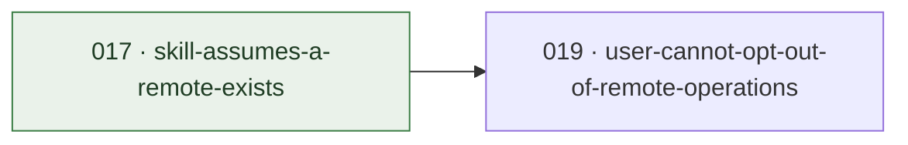

<!--
  GENERATED FILE — do not hand-edit.
  Source: tasks/<status>/NNN-*.md frontmatter + H1 titles.
  Regenerate: scripts/generate-task-board.py  (run --check in CI for freshness)
-->

# Task board

Projection of `tasks/` — the directory is the tracker, this is its view. Columns are the
lanes in flow order; `prioritized/` is in pull order. Move a file, regenerate, commit.
Cards show `owner · last updated`, and `⛔` on a blocked task — a task number when another
task gates it, `condition` when nothing but a judgement call does.

**19 tasks** — 5 new · 1 prioritized · 0 wip · 0 blocked · 13 done.

WIP limit: within 3 per human owner.

| new (5) | prioritized (1) | wip (0) | blocked (0) |
|---|---|---|---|
| **[012](../tasks/new/012-install-is-verified-once-by-hand.md)** Installability is the product, and it is checked once by h… justmaniv · 2026-08-07 | **[019](../tasks/prioritized/019-user-cannot-opt-out-of-remote-operations.md)** A user can turn off git and host operations even when a re… justmaniv · 2026-08-08 · ⛔ 017 | _nothing pulled_ | _nothing waiting_ |
| **[013](../tasks/new/013-adopters-copy-of-the-generator-drifts.md)** The adopter's copy of the board generator can never be upd… justmaniv · 2026-08-07 |  |  |  |
| **[014](../tasks/new/014-eval-suite-covers-two-transitions.md)** Three of the five transitions worth testing have no eval c… justmaniv · 2026-08-07 |  |  |  |
| **[015](../tasks/new/015-eval-deltas-pin-no-model.md)** The eval numbers have no model attached, so they expire wi… justmaniv · 2026-08-07 |  |  |  |
| **[018](../tasks/new/018-capability-surface-is-undocumented.md)** Nobody can say what Cannery Row's feature set is, includin… justmaniv · 2026-08-09 |  |  |  |

## Blocked-by graph

Edge reads *blocker → blocked*. Green = blocker already closed (stale reference). Amber = a condition, not a task.

## done (13)

Collapsed — the 12 most recently completed of 13. The full pile is `tasks/done/`; git history is its journey.

| # | Task | Completed |
|---|---|---|
| [017](../tasks/done/017-skill-assumes-a-remote-exists.md) | The skill mandates a push, so it fails on a project that has no remote | 2026-08-08 |
| [016](../tasks/done/016-two-pass-claim-is-unmeasured.md) | The README's headline claim is the one thing the eval suite does not measure | 2026-08-08 |
| [011](../tasks/done/011-no-changelog.md) | An adopter who updates cannot find out what changed | 2026-08-07 |
| [010](../tasks/done/010-releases-have-no-tags.md) | Eight versions have shipped and none of them is findable in git | 2026-08-07 |
| [009](../tasks/done/009-adopters-cannot-run-the-board-or-the-gate.md) | An adopter following the README cannot run the board, or the gate that enforces the contract | 2026-08-07 |
| [008](../tasks/done/008-the-gates-are-untested-and-coverage-is-ungated.md) | The gates that enforce everything are themselves untested, and nothing floors coverage | 2026-08-07 |
| [007](../tasks/done/007-task-body-contract-is-undocumented-and-unenforced.md) | A task file's body has a contract, and nothing states it or checks it | 2026-08-07 |
| [004](../tasks/done/004-author-eval-suite-for-the-skill.md) | Nothing tests whether the skill is followed, only that it is well-formed | 2026-08-07 |
| [006](../tasks/done/006-disable-was-wrong-uninstall-is-required.md) | CONTRIBUTING told you to disable the installed copy; disabling does not work | 2026-08-06 |
| [005](../tasks/done/005-worktree-removal-trap-and-no-regeneration-step.md) | Two defects found by a session using the skill for real work | 2026-08-06 |
| [003](../tasks/done/003-pinned-version-silently-withheld-the-fix.md) | A pinned version withheld the fix, and reported success while doing it | 2026-08-06 |
| [002](../tasks/done/002-decide-notice-copyright-holder.md) | Decide whether NOTICE should carry a legal name | 2026-08-06 |
